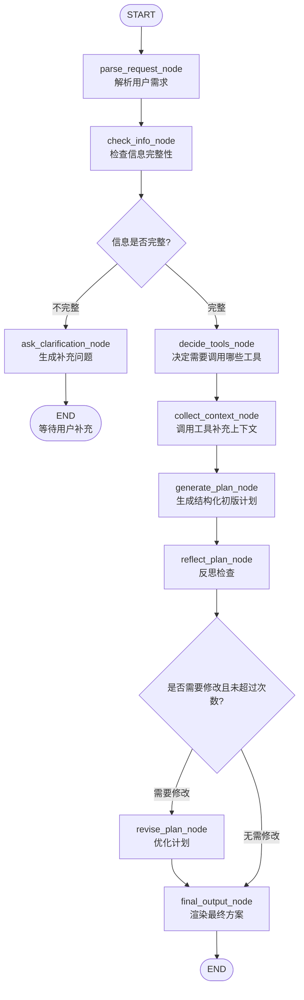

# 基于 LangChain + LangGraph 的旅行规划助手技术方案（优化版）

> 项目定位：面向 Agent Python 技术栈初学者的 LangChain + LangGraph 实践项目  
> 项目目标：通过一个业务不复杂、流程清晰、工具调用自然的旅行规划场景，系统理解 Agent 工程中的 Prompt、Tool、Chain、Structured Output、StateGraph、Workflow、Reflection、错误处理与阶段化演进。  
> 推荐实现策略：先用 **Pure Python + LangGraph + Mock Tools** 跑通最小闭环，再逐步替换为 LangChain LLM Chain、真实 API、interrupt/resume、多轮记忆和评估系统。

---

## 1. 项目背景与学习目标

旅行规划助手非常适合作为 LangChain + LangGraph 的入门项目，因为它天然包含一个完整 Agent 工作流：

```text
用户自然语言输入
→ 结构化需求解析
→ 信息完整性检查
→ 缺失信息追问
→ 工具调用补充上下文
→ 初版计划生成
→ Reflection 自检
→ 方案修正
→ 最终输出
```

这个项目的核心目的不是做一个商业级旅游平台，而是帮助初学者理解 Agent 工程的基本结构：

1. 如何用 Python 组织一个基础 Agent 项目；
2. 如何用 LangChain 封装 LLM、Prompt、Tool、Chain、Structured Output；
3. 如何用 LangGraph 编排 State、Node、Edge、Conditional Edge；
4. 如何把模糊用户需求转成结构化任务状态；
5. 如何用工具补充外部信息；
6. 如何用 Reflection 对初版结果做质量控制；
7. 如何从 mock 工具平滑升级到真实搜索、天气、地图等 API；
8. 如何避免 Agent 流程无限循环、工具异常、状态混乱等常见问题。

---

## 2. 项目核心功能

### 2.1 MVP 必须支持的功能

| 功能 | 说明 |
|---|---|
| 用户需求解析 | 提取目的地、出行时间、天数、预算、偏好、同行人等字段 |
| 信息完整性检查 | 判断目的地、天数、预算、偏好等字段是否缺失 |
| 缺失信息追问 | 信息不足时生成 1—3 个澄清问题 |
| Mock 工具调用 | 使用本地 mock 数据模拟天气、景点、美食、预算、交通 |
| 初版计划生成 | 根据结构化需求和工具结果生成旅行计划 |
| Reflection 自检 | 检查预算、行程密度、偏好匹配、天气风险等问题 |
| 方案修正 | 根据反思结果优化计划，MVP 阶段最多修正一次 |
| 最终输出 | 输出结构清晰、可读、带提醒的旅行方案 |
| 端到端测试 | 能用一条输入跑通完整流程 |

### 2.2 后续扩展功能

| 扩展功能 | 说明 |
|---|---|
| LLM 结构化解析 | 使用 LangChain + Pydantic Structured Output 替代规则解析 |
| LLM 计划生成 | 使用 Prompt + ChatModel 生成更自然的旅行计划 |
| LLM Reflection | 使用结构化反思结果替代规则反思 |
| 真实联网搜索 | 接入 Tavily、SerpAPI、Bing Search 等服务 |
| 真实天气 API | 接入 OpenWeather、和风天气等服务 |
| 地图路线估算 | 接入高德、百度、Google Maps 等 API |
| interrupt/resume | 信息不足时暂停图执行，用户补充后继续 |
| checkpoint | 保存会话状态，支持多轮继续规划 |
| FastAPI 服务化 | 提供 HTTP 接口，方便接前端或 Web Demo |
| 评估系统 | 对信息抽取、工具调用、预算合理性、偏好匹配进行测试 |

---

## 3. 技术栈选型说明

### 3.1 Python

Python 负责项目整体开发，包括：

- 项目结构组织；
- State 类型定义；
- Node 函数实现；
- Mock 工具函数；
- LangChain Chain 封装；
- LangGraph 工作流编排；
- 单元测试和端到端测试。

### 3.2 LangChain 的职责

LangChain 主要负责“节点内部能力”。

| 能力 | 在本项目中的作用 |
|---|---|
| ChatModel / LLM | 完成需求解析、计划生成、反思检查等开放任务 |
| ChatPromptTemplate | 管理不同节点的 Prompt 模板 |
| Pydantic Structured Output | 约束模型输出为结构化对象 |
| Tool | 封装天气、景点、美食、预算、交通等工具 |
| Chain | 组合 Prompt → Model → Parser 的局部流程 |
| Output Parser | 将模型回复转为字符串或结构化结果 |

一句话：

> LangChain 负责“节点里面怎么调用模型、怎么写 Prompt、怎么定义工具、怎么拿到结构化输出”。

### 3.3 LangGraph 的职责

LangGraph 主要负责“外层流程编排”。

| 能力 | 在本项目中的作用 |
|---|---|
| StateGraph | 定义旅行规划工作流 |
| State | 保存用户输入、结构化需求、工具结果、草案、反思和最终结果 |
| Node | 将任务拆成解析、检查、工具调用、生成、反思、修正等步骤 |
| Edge | 定义固定执行顺序 |
| Conditional Edge | 根据信息是否完整、是否需要修正决定下一步 |
| START / END | 定义流程开始和结束 |
| interrupt / resume | 后续用于信息不足时暂停并等待用户补充 |
| checkpoint | 后续用于保存图状态，支持多轮会话 |

一句话：

> LangGraph 负责“流程怎么走、状态怎么传、什么时候分支、什么时候结束”。

---

## 4. 推荐学习演进路线

为了避免一开始过度复杂，建议按 V0、V1、V2 三个阶段实现。

### 4.1 V0：Pure Python + LangGraph + Mock Tools

目标：理解 LangGraph 的 State、Node、Edge、Conditional Edge。

本阶段不接真实 LLM，不接真实 API。

```text
规则解析用户输入
→ 检查信息完整性
→ 缺失信息追问
→ 调用 mock 工具
→ 模板生成计划
→ 规则 Reflection
→ 输出最终方案
```

### 4.2 V1：LangChain + LangGraph + Structured Output

目标：理解 LangChain 在节点内部的作用。

本阶段开始替换部分规则逻辑：

```text
规则解析 → LLM + Pydantic 结构化解析
模板生成 → Prompt + ChatModel 计划生成
规则 Reflection → LLM + 结构化 Reflection
```

### 4.3 V2：真实 API + interrupt/resume + 评估

目标：接近真实 Agent 工程。

本阶段加入：

```text
真实搜索 API
真实天气 API
地图路线估算
LangGraph checkpoint
interrupt/resume
FastAPI 服务化
基础评估系统
```

---

## 5. 整体架构设计

### 5.1 架构分层

```text
用户输入
  ↓
LangGraph Workflow 层
  ├── parse_request_node
  ├── check_info_node
  ├── ask_clarification_node
  ├── decide_tools_node
  ├── collect_context_node
  ├── generate_plan_node
  ├── reflect_plan_node
  ├── revise_plan_node
  └── final_output_node
  ↓
LangChain 能力层
  ├── PromptTemplate
  ├── ChatModel
  ├── Structured Output
  ├── Tools
  └── Chain
  ↓
工具层
  ├── MockWeatherTool
  ├── MockAttractionTool
  ├── MockFoodTool
  ├── MockBudgetTool
  ├── MockTransportTool
  └── 后续真实 API
```

### 5.2 LangChain 与 LangGraph 的边界

| 问题 | 交给谁 | 原因 |
|---|---|---|
| 用户需求如何抽取字段 | LangChain 或规则节点 | V0 用规则，V1 用 LLM + Structured Output |
| 是否缺失信息后走哪个分支 | LangGraph | 属于流程控制 |
| 工具如何定义输入输出 | LangChain Tool | 工具需要 schema、描述和可调用接口 |
| 哪些工具需要调用 | 普通节点 / LangChain | V0 固定调用，V1/V2 可动态选择 |
| 工具结果放在哪里 | LangGraph State | 需要跨节点共享 |
| 初版旅行计划如何生成 | LangChain 或模板节点 | V0 用模板，V1 用 LLM Chain |
| Reflection 放在哪里 | LangGraph 节点 | 反思是流程中的独立质量控制步骤 |
| 是否需要重新生成计划 | LangGraph 条件边 | 属于条件路由 |
| 最终结果如何渲染 | 普通节点 | 将结构化计划转成 Markdown |

---

## 6. LangGraph 工作流设计

### 6.1 工作流 Mermaid 图



### 6.2 为什么旅行规划适合 Workflow + Agent？

旅行规划不是一次简单问答，而是一个多步骤任务：

```text
理解需求 → 补全信息 → 查询资料 → 生成计划 → 检查合理性 → 修正计划 → 输出结果
```

如果只用一次 LLM 调用，容易出现：

- 信息缺失时强行规划；
- 忽略预算；
- 行程过满；
- 景点路线不顺；
- 没有考虑天气；
- 没有体现用户偏好；
- 计划不可测试、不可复盘。

Workflow 可以把任务拆开，让每一步有明确职责。Agent 能在部分节点里调用工具、使用 LLM 判断，并根据中间结果优化方案。

---

## 7. State 状态结构设计

### 7.1 State 设计原则

State 是整个工作流的共享数据中心。每个节点从 State 读取已有信息，并返回部分字段更新。

优化后不建议把所有字段平铺在最外层，而是按职责分组：

```text
user_input：原始输入
request：结构化旅行需求
context：工具补充信息
plan：结构化旅行计划
reflection：反思结果
control：流程控制字段
errors：错误信息
```

### 7.2 推荐 State 结构

```python
from typing_extensions import TypedDict
from typing import Optional, List, Dict, Any


class TravelState(TypedDict, total=False):
    # 原始输入
    user_input: str

    # 结构化需求
    request: Dict[str, Any]

    # 信息完整性检查
    missing_fields: List[str]
    clarification_questions: List[str]
    is_info_complete: bool

    # 工具选择和工具结果
    required_tools: List[str]
    context: Dict[str, Any]

    # 计划与反思
    draft_plan: Dict[str, Any]
    reflection: Dict[str, Any]
    final_plan: str

    # 流程控制
    need_revision: bool
    revision_count: int
    max_revision_count: int

    # 错误记录
    tool_errors: List[str]
    system_errors: List[str]
```

### 7.3 为什么这样设计？

相比扁平结构：

```python
state["destination"]
state["weather_info"]
state["budget_estimate"]
state["reflection_result"]
```

分层结构更清楚：

```python
state["request"]["destination"]
state["context"]["weather"]
state["context"]["budget_estimate"]
state["reflection"]["issues"]
```

优点：

1. 字段职责更清晰；
2. 后续扩展不会把 State 变成“大杂烩”；
3. 工具结果统一放进 `context`，便于计划生成节点读取；
4. 反思结果统一放进 `reflection`，便于路由判断；
5. 错误信息统一收集，便于最终输出提醒和测试。

### 7.4 为什么使用 `total=False`？

```python
class TravelState(TypedDict, total=False):
```

表示 State 中字段不是一开始都必须存在。

初始输入可能只有：

```python
{
    "user_input": "我想 6 月底去成都玩 3 天，预算 3000，喜欢美食和轻松路线"
}
```

后续节点才会逐步补充：

```python
{
    "request": {
        "destination": "成都",
        "days": 3,
        "budget": 3000,
        "preferences": ["美食", "轻松"]
    },
    "context": {...},
    "draft_plan": {...}
}
```

这更符合 LangGraph 的状态流动方式。

---

## 8. 结构化 Schema 设计

为了后续平滑升级到 LangChain Structured Output，建议从一开始就设计 Pydantic Schema。

### 8.1 旅行需求 Schema

```python
from pydantic import BaseModel, Field
from typing import Optional, List


class TravelRequest(BaseModel):
    destination: Optional[str] = Field(default=None, description="目的地城市")
    start_date: Optional[str] = Field(default=None, description="出发日期或时间范围")
    days: Optional[int] = Field(default=None, description="旅行天数")
    budget: Optional[float] = Field(default=None, description="总预算，单位元")
    preferences: List[str] = Field(default_factory=list, description="旅行偏好，例如美食、轻松、自然风光")
    companions: Optional[str] = Field(default=None, description="同行人，例如独自、情侣、朋友、亲子")
```

### 8.2 结构化计划 Schema

不建议将 `draft_plan` 直接设计成一个纯字符串。更推荐让计划先以结构化对象存在，最后再渲染成 Markdown。

```python
class DayPlan(BaseModel):
    day: int
    theme: str
    morning: str
    afternoon: str
    evening: str
    estimated_cost: float
    notes: List[str] = Field(default_factory=list)


class TravelPlan(BaseModel):
    destination: str
    total_days: int
    total_budget: float
    days: List[DayPlan]
    total_estimated_cost: float
    risk_notes: List[str] = Field(default_factory=list)
```

这样做的好处：

1. Reflection 可以检查每天景点数量、预算、休息安排；
2. 最终输出可以稳定渲染成 Markdown；
3. 测试用例可以断言结构字段，而不是只判断字符串；
4. 后续接 LLM 时可以用 Pydantic Structured Output 约束模型输出。

### 8.3 Reflection Schema

```python
class ReflectionResult(BaseModel):
    need_revision: bool = Field(description="是否需要修改旅行计划")
    issues: List[str] = Field(default_factory=list, description="发现的问题")
    suggestions: List[str] = Field(default_factory=list, description="修改建议")
    score: int = Field(description="计划质量评分，1-10")
```

---

## 9. Node 节点职责设计

### 9.1 节点总览

| 节点 | 类型 | 职责 |
|---|---|---|
| `parse_request_node` | 规则 / LLM 节点 | 从自然语言中抽取结构化旅行需求 |
| `check_info_node` | 普通 Python 节点 | 检查目的地、天数、预算、偏好等字段是否完整 |
| `ask_clarification_node` | 模板 / LLM 节点 | 信息不足时生成补充问题 |
| `decide_tools_node` | 普通 Python 节点 | 根据需求决定需要调用哪些工具 |
| `collect_context_node` | 工具调用节点 | 调用天气、景点、美食、预算、交通工具 |
| `generate_plan_node` | 模板 / LLM 节点 | 生成结构化初版旅行计划 |
| `reflect_plan_node` | 规则 / LLM 节点 | 检查计划是否合理 |
| `revise_plan_node` | 普通 / LLM 节点 | 根据反思建议修正计划 |
| `final_output_node` | 普通节点 | 将结构化计划渲染为最终 Markdown |

### 9.2 普通节点、LLM 节点、工具节点的区别

| 节点类型 | 是否调用 LLM | 是否调用工具 | 适合场景 |
|---|---|---|---|
| 普通 Python 节点 | 否 | 否 | 字段检查、路由判断、状态合并、格式渲染 |
| LLM 节点 | 是 | 可选 | 需求解析、开放生成、复杂判断、反思评价 |
| 工具节点 | 否或少量 LLM | 是 | 查询天气、景点、美食、预算、交通等外部信息 |

初学阶段建议优先使用普通节点和 mock 工具，等流程跑通后再逐步替换为 LLM 节点。

---

## 10. Tool 工具调用设计

### 10.1 MVP 阶段为什么使用 mock 工具？

初学阶段不建议一上来接真实 API，原因是：

1. API Key、额度、网络、鉴权会干扰学习重点；
2. mock 数据稳定，便于测试；
3. 可以先理解 Tool 输入输出和 State 流动；
4. 后续只要保持工具 schema 不变，就能平滑替换真实 API。

### 10.2 工具清单

| 工具名 | 输入 | 输出 | MVP 实现 |
|---|---|---|---|
| `get_weather` | city, date_range | 天气摘要、风险、来源、更新时间 | mock |
| `search_attractions` | city, preferences | 景点列表、来源、更新时间 | mock |
| `search_foods` | city, preferences | 美食列表、来源、更新时间 | mock |
| `estimate_budget` | city, days, budget | 预算拆分、是否紧张、来源 | mock |
| `search_transport` | city | 市内交通建议、来源 | mock |

### 10.3 工具输出统一规范

所有工具建议统一返回：

```python
{
    "data": ...,              # 核心数据
    "source": "mock_weather", # 数据来源
    "updated_at": "2026-05-27",
    "confidence": "mock",    # mock / high / medium / low
    "error": None             # 错误信息，没有错误则为 None
}
```

为什么需要这样设计？

1. 旅行信息有时效性，必须知道数据来源和更新时间；
2. 后续真实 API 失败时，可以在 `error` 中记录；
3. Reflection 和 final_output 可以提醒用户哪些信息需要出行前再次确认；
4. 测试工具结果时字段更统一。

### 10.4 工具定义示例

```python
from langchain_core.tools import tool
from datetime import date


@tool
def get_weather(city: str) -> dict:
    """查询目的地天气。MVP 阶段返回 mock 天气数据。"""
    mock_data = {
        "成都": {
            "summary": "6 月底成都天气较热，可能有阵雨，建议携带雨具。",
            "temperature": "24-32°C",
            "risk": "afternoon_rain"
        }
    }

    data = mock_data.get(city, {
        "summary": "暂无天气数据，建议出行前再次查询。",
        "temperature": "unknown",
        "risk": "unknown"
    })

    return {
        "data": data,
        "source": "mock_weather",
        "updated_at": str(date.today()),
        "confidence": "mock",
        "error": None
    }


@tool
def search_attractions(city: str, preferences: list[str]) -> dict:
    """根据城市和用户偏好推荐景点。"""
    if city == "成都":
        data = [
            {"name": "人民公园", "type": "relax", "duration": "1.5h", "note": "适合喝茶休息"},
            {"name": "宽窄巷子", "type": "city_walk", "duration": "2h", "note": "适合轻松游览"},
            {"name": "成都大熊猫繁育研究基地", "type": "classic", "duration": "3h", "note": "建议上午前往"},
            {"name": "武侯祠", "type": "history", "duration": "2h", "note": "文化景点"}
        ]
    else:
        data = []

    return {
        "data": data,
        "source": "mock_attractions",
        "updated_at": str(date.today()),
        "confidence": "mock",
        "error": None
    }
```

### 10.5 工具异常处理建议

真实 API 阶段，工具可能失败。`collect_context_node` 不应该因为某个工具失败就让整个图崩溃。

推荐写法：

```python
def safe_tool_call(tool, args: dict, fallback: dict) -> tuple[dict, str | None]:
    try:
        result = tool.invoke(args)
        return result, None
    except Exception as e:
        return fallback, str(e)
```

工具节点统一收集错误：

```python
return {
    "context": context,
    "tool_errors": errors
}
```

最终输出时可以提示：

```text
部分信息来自 mock 或暂不可用，建议出行前再次确认景点开放时间、天气和交通情况。
```

### 10.6 工具选择策略

V0 阶段可以固定调用所有工具：

```text
weather + attractions + foods + budget + transport
```

V1/V2 可以加入 `decide_tools_node`：

```python
def decide_tools_node(state: TravelState) -> dict:
    request = state["request"]
    preferences = request.get("preferences", [])

    required_tools = ["weather", "attractions", "budget", "transport"]

    if "美食" in preferences:
        required_tools.append("foods")

    return {"required_tools": required_tools}
```

这样更接近真实 Agent：不是所有问题都调用所有工具，而是根据任务需求选择工具。

---

## 11. Reflection 反思机制设计

### 11.1 Reflection 应该放在哪里？

Reflection 应该放在：

```text
generate_plan_node → reflect_plan_node → revise_plan_node/final_output_node
```

也就是初版计划生成之后，最终输出之前。

原因：

1. 反思必须基于已有计划进行；
2. 它不能太早，否则没有检查对象；
3. 它不能太晚，否则最终方案已经输出；
4. 它适合作为质量控制节点。

### 11.2 Reflection 检查维度

| 检查维度 | 示例问题 |
|---|---|
| 预算合理性 | 是否明显超出预算？预算拆分是否合理？ |
| 行程密度 | 每天景点是否过多？是否留有休息时间？ |
| 路线顺路 | 同一天景点是否过于分散？ |
| 偏好匹配 | 是否体现美食、轻松路线等偏好？ |
| 天气风险 | 是否考虑高温、降雨等影响？ |
| 信息完整性 | 是否有关键字段缺失仍强行规划？ |
| 表达清晰度 | 是否按天输出？是否给出预算和注意事项？ |

### 11.3 防止 Reflection 循环失控

如果后续设计成：

```text
reflect_plan → revise_plan → reflect_plan
```

必须限制修正次数，否则容易无限循环。

State 中建议加入：

```python
revision_count: int
max_revision_count: int
```

路由逻辑：

```python
def route_after_reflection(state: TravelState):
    need_revision = state.get("need_revision", False)
    revision_count = state.get("revision_count", 0)
    max_revision_count = state.get("max_revision_count", 1)

    if need_revision and revision_count < max_revision_count:
        return "revise_plan"
    return "final_output"
```

MVP 阶段建议最多修正一次。

---

## 12. 信息不足时如何追问和继续？

### 12.1 MVP 简单版

MVP 阶段可以这样做：

```text
信息不完整
→ ask_clarification_node 生成问题
→ END
→ 用户补充信息后重新 invoke
```

示例：

```python
result = graph.invoke({
    "user_input": "我想出去玩"
})

print(result["clarification_questions"])

# 用户补充：去成都，3天，预算3000，喜欢美食
new_state = {
    **result,
    "user_input": "去成都，3天，预算3000，喜欢美食"
}

result = graph.invoke(new_state)
```

这种方式简单，适合初学者。

### 12.2 进阶版：interrupt / resume

后续可以使用 LangGraph 的 interrupt/resume：

```text
ask_clarification_node 中 interrupt
→ 图暂停
→ 前端展示问题
→ 用户补充
→ resume 后继续执行
```

进阶版需要 checkpoint 保存当前图状态。MVP 阶段不建议一开始就做，避免增加复杂度。

---

## 13. 项目目录结构

### 13.1 V0 最小可跑目录

第一版建议目录尽量简单：

```text
travel-planning-agent/
  main.py
  state.py
  tools.py
  nodes.py
  routers.py
  workflow.py
  tests/
    test_workflow.py
```

目标是快速跑通完整流程。

### 13.2 V1/V2 工程化目录

跑通后再拆成工程结构：

```text
travel-planning-agent/
  README.md
  pyproject.toml
  .env.example

  app/
    __init__.py
    main.py

    graph/
      __init__.py
      state.py
      workflow.py
      nodes.py
      routers.py

    chains/
      __init__.py
      parse_chain.py
      plan_chain.py
      reflection_chain.py
      revise_chain.py

    prompts/
      __init__.py
      parse_prompt.py
      plan_prompt.py
      reflection_prompt.py
      revise_prompt.py

    tools/
      __init__.py
      weather_tool.py
      attraction_tool.py
      food_tool.py
      budget_tool.py
      transport_tool.py

    schemas/
      __init__.py
      travel_request.py
      travel_plan.py
      reflection.py

    config/
      __init__.py
      settings.py

  tests/
    test_parse.py
    test_tools.py
    test_reflection.py
    test_workflow.py

  docs/
    architecture.md
    workflow.md
```

建议顺序：

```text
先 V0 单文件/少文件跑通
再 V1 拆分 prompts/chains/schemas/tools
最后 V2 服务化和真实 API
```

---

## 14. MVP 实现步骤

### Step 1：搭建环境

```bash
mkdir travel-planning-agent
cd travel-planning-agent

python -m venv .venv
source .venv/bin/activate  # Windows 使用 .venv\Scripts\activate

pip install langchain langgraph langchain-openai pydantic python-dotenv pytest
```

V0 如果暂时不用真实模型，可以先不配置 API Key。

### Step 2：定义 State

先定义分层版 `TravelState`。

### Step 3：实现 mock tools

实现天气、景点、美食、预算、交通五个 mock 工具，并统一输出：

```text
data + source + updated_at + confidence + error
```

### Step 4：实现 parse_request_node

V0 先用规则解析：

```text
成都 → destination=成都
3天 / 3 天 → days=3
3000 → budget=3000
美食 / 轻松 → preferences
```

V1 再替换为 LLM + Pydantic Structured Output。

### Step 5：实现 check_info_node

检查：

```text
destination
days
budget
preferences
```

### Step 6：实现 ask_clarification_node

缺失什么字段就追问什么。

### Step 7：实现 decide_tools_node

V0 可以固定返回所有工具，V1 再根据偏好动态选择。

### Step 8：实现 collect_context_node

调用 mock 工具，把结果写入：

```python
state["context"]
```

### Step 9：实现 generate_plan_node

V0 用模板生成结构化计划；V1 用 LLM 生成 `TravelPlan`。

### Step 10：实现 reflect_plan_node

V0 用规则检查；V1 用 LLM + `ReflectionResult`。

### Step 11：实现 revise_plan_node

根据 Reflection 建议修改计划，同时更新：

```python
revision_count += 1
```

### Step 12：实现 final_output_node

将结构化 `TravelPlan` 渲染为 Markdown 字符串。

### Step 13：组装 LangGraph

使用 `StateGraph` 连接所有节点和条件边。

### Step 14：编写测试

至少测试：

```text
需求解析
信息缺失追问
工具返回格式
Reflection
端到端流程
```

---

## 15. 关键代码骨架示例

### 15.1 state.py

```python
from typing_extensions import TypedDict
from typing import List, Dict, Any


class TravelState(TypedDict, total=False):
    user_input: str

    request: Dict[str, Any]

    missing_fields: List[str]
    clarification_questions: List[str]
    is_info_complete: bool

    required_tools: List[str]
    context: Dict[str, Any]

    draft_plan: Dict[str, Any]
    reflection: Dict[str, Any]
    final_plan: str

    need_revision: bool
    revision_count: int
    max_revision_count: int

    tool_errors: List[str]
    system_errors: List[str]
```

### 15.2 nodes.py

```python
from state import TravelState
from tools import get_weather, search_attractions, search_foods, estimate_budget, search_transport


def parse_request_node(state: TravelState) -> dict:
    text = state["user_input"]

    request = state.get("request", {}).copy()
    preferences = request.get("preferences", [])

    if "成都" in text:
        request["destination"] = "成都"
    if "3天" in text or "3 天" in text:
        request["days"] = 3
    if "3000" in text:
        request["budget"] = 3000
    if "美食" in text and "美食" not in preferences:
        preferences.append("美食")
    if "轻松" in text and "轻松" not in preferences:
        preferences.append("轻松")

    request["preferences"] = preferences

    return {
        "request": request,
        "revision_count": state.get("revision_count", 0),
        "max_revision_count": state.get("max_revision_count", 1),
        "tool_errors": state.get("tool_errors", []),
        "system_errors": state.get("system_errors", [])
    }


def check_info_node(state: TravelState) -> dict:
    request = state.get("request", {})
    missing = []

    if not request.get("destination"):
        missing.append("destination")
    if not request.get("days"):
        missing.append("days")
    if not request.get("budget"):
        missing.append("budget")
    if not request.get("preferences"):
        missing.append("preferences")

    return {
        "missing_fields": missing,
        "is_info_complete": len(missing) == 0
    }


def ask_clarification_node(state: TravelState) -> dict:
    field_to_question = {
        "destination": "你想去哪个城市旅行？",
        "days": "你计划玩几天？",
        "budget": "你的总预算大概是多少？",
        "preferences": "你更喜欢美食、自然风光、历史文化，还是轻松休闲路线？"
    }

    questions = [
        field_to_question[field]
        for field in state.get("missing_fields", [])
        if field in field_to_question
    ]

    return {
        "clarification_questions": questions,
        "final_plan": "为了更准确地规划行程，请先补充：\n" + "\n".join(f"- {q}" for q in questions)
    }


def decide_tools_node(state: TravelState) -> dict:
    request = state["request"]
    preferences = request.get("preferences", [])

    required_tools = ["weather", "attractions", "budget", "transport"]

    if "美食" in preferences:
        required_tools.append("foods")

    return {"required_tools": required_tools}


def collect_context_node(state: TravelState) -> dict:
    request = state["request"]
    city = request["destination"]
    days = request["days"]
    budget = request["budget"]
    preferences = request.get("preferences", [])
    required_tools = state.get("required_tools", [])

    context = {}
    errors = []

    try:
        if "weather" in required_tools:
            context["weather"] = get_weather.invoke({"city": city})
        if "attractions" in required_tools:
            context["attractions"] = search_attractions.invoke({"city": city, "preferences": preferences})
        if "foods" in required_tools:
            context["foods"] = search_foods.invoke({"city": city, "preferences": preferences})
        if "budget" in required_tools:
            context["budget_estimate"] = estimate_budget.invoke({"city": city, "days": days, "budget": budget})
        if "transport" in required_tools:
            context["transport"] = search_transport.invoke({"city": city})
    except Exception as e:
        errors.append(str(e))

    return {
        "context": context,
        "tool_errors": state.get("tool_errors", []) + errors
    }


def generate_plan_node(state: TravelState) -> dict:
    request = state["request"]
    context = state.get("context", {})

    plan = {
        "destination": request["destination"],
        "total_days": request["days"],
        "total_budget": request["budget"],
        "days": [
            {
                "day": 1,
                "theme": "抵达与轻松 city walk",
                "morning": "抵达成都，前往酒店办理入住或寄存行李",
                "afternoon": "人民公园喝茶，体验成都慢生活",
                "evening": "春熙路/太古里附近吃火锅",
                "estimated_cost": 450,
                "notes": ["第一天以适应节奏为主，不安排过多景点"]
            },
            {
                "day": 2,
                "theme": "熊猫基地与城市休闲",
                "morning": "成都大熊猫繁育研究基地",
                "afternoon": "宽窄巷子轻松游览",
                "evening": "建设路或玉林体验串串香",
                "estimated_cost": 550,
                "notes": ["熊猫基地建议上午前往"]
            },
            {
                "day": 3,
                "theme": "文化景点与返程",
                "morning": "武侯祠",
                "afternoon": "锦里或周边轻松逛街",
                "evening": "根据返程时间前往车站或机场",
                "estimated_cost": 400,
                "notes": ["最后一天避免安排太远景点"]
            }
        ],
        "total_estimated_cost": 1400,
        "risk_notes": [
            context.get("weather", {}).get("data", {}).get("summary", "建议出行前再次确认天气。")
        ]
    }

    return {"draft_plan": plan}


def reflect_plan_node(state: TravelState) -> dict:
    request = state["request"]
    plan = state["draft_plan"]

    issues = []
    suggestions = []

    if plan["total_estimated_cost"] > request["budget"]:
        issues.append("预计花费超过预算")
        suggestions.append("减少高消费餐饮或压缩门票支出")

    for day in plan["days"]:
        if day["estimated_cost"] > request["budget"] / request["days"] * 1.5:
            issues.append(f"第 {day['day']} 天预算偏高")

    if "轻松" in request.get("preferences", []):
        suggestions.append("保留午后休息时间，避免每天安排过多景点")

    need_revision = len(issues) > 0

    return {
        "reflection": {
            "need_revision": need_revision,
            "issues": issues,
            "suggestions": suggestions,
            "score": 8 if not need_revision else 6
        },
        "need_revision": need_revision
    }


def revise_plan_node(state: TravelState) -> dict:
    plan = state["draft_plan"].copy()
    revision_count = state.get("revision_count", 0) + 1

    plan["risk_notes"] = plan.get("risk_notes", []) + state.get("reflection", {}).get("suggestions", [])

    return {
        "draft_plan": plan,
        "revision_count": revision_count,
        "need_revision": False
    }


def final_output_node(state: TravelState) -> dict:
    plan = state["draft_plan"]
    tool_errors = state.get("tool_errors", [])

    lines = []
    lines.append(f"# {plan['destination']}{plan['total_days']}日旅行方案")
    lines.append("")
    lines.append(f"- 总预算：{plan['total_budget']} 元")
    lines.append(f"- 预计基础花费：{plan['total_estimated_cost']} 元")
    lines.append("")

    for day in plan["days"]:
        lines.append(f"## Day {day['day']}：{day['theme']}")
        lines.append(f"- 上午：{day['morning']}")
        lines.append(f"- 下午：{day['afternoon']}")
        lines.append(f"- 晚上：{day['evening']}")
        lines.append(f"- 预计花费：{day['estimated_cost']} 元")
        for note in day.get("notes", []):
            lines.append(f"- 提醒：{note}")
        lines.append("")

    if plan.get("risk_notes"):
        lines.append("## 出行提醒")
        for note in plan["risk_notes"]:
            lines.append(f"- {note}")
        lines.append("")

    if tool_errors:
        lines.append("## 信息可用性提醒")
        lines.append("- 部分工具信息暂不可用，建议出行前再次确认天气、景点开放时间和交通情况。")

    return {"final_plan": "\n".join(lines)}
```

### 15.3 routers.py

```python
from typing import Literal
from state import TravelState


def route_after_check(state: TravelState) -> Literal["ask_clarification", "decide_tools"]:
    if state.get("is_info_complete"):
        return "decide_tools"
    return "ask_clarification"


def route_after_reflection(state: TravelState) -> Literal["revise_plan", "final_output"]:
    need_revision = state.get("need_revision", False)
    revision_count = state.get("revision_count", 0)
    max_revision_count = state.get("max_revision_count", 1)

    if need_revision and revision_count < max_revision_count:
        return "revise_plan"
    return "final_output"
```

### 15.4 workflow.py

```python
from langgraph.graph import StateGraph, START, END

from state import TravelState
from nodes import (
    parse_request_node,
    check_info_node,
    ask_clarification_node,
    decide_tools_node,
    collect_context_node,
    generate_plan_node,
    reflect_plan_node,
    revise_plan_node,
    final_output_node,
)
from routers import route_after_check, route_after_reflection


def build_graph():
    builder = StateGraph(TravelState)

    builder.add_node("parse_request", parse_request_node)
    builder.add_node("check_info", check_info_node)
    builder.add_node("ask_clarification", ask_clarification_node)
    builder.add_node("decide_tools", decide_tools_node)
    builder.add_node("collect_context", collect_context_node)
    builder.add_node("generate_plan", generate_plan_node)
    builder.add_node("reflect_plan", reflect_plan_node)
    builder.add_node("revise_plan", revise_plan_node)
    builder.add_node("final_output", final_output_node)

    builder.add_edge(START, "parse_request")
    builder.add_edge("parse_request", "check_info")

    builder.add_conditional_edges(
        "check_info",
        route_after_check,
        {
            "ask_clarification": "ask_clarification",
            "decide_tools": "decide_tools"
        }
    )

    builder.add_edge("ask_clarification", END)

    builder.add_edge("decide_tools", "collect_context")
    builder.add_edge("collect_context", "generate_plan")
    builder.add_edge("generate_plan", "reflect_plan")

    builder.add_conditional_edges(
        "reflect_plan",
        route_after_reflection,
        {
            "revise_plan": "revise_plan",
            "final_output": "final_output"
        }
    )

    builder.add_edge("revise_plan", "final_output")
    builder.add_edge("final_output", END)

    return builder.compile()
```

### 15.5 main.py

```python
from workflow import build_graph


def main():
    graph = build_graph()

    result = graph.invoke({
        "user_input": "我想 6 月底去成都玩 3 天，预算 3000 元，喜欢美食和轻松一点的路线",
        "max_revision_count": 1
    })

    print(result["final_plan"])


if __name__ == "__main__":
    main()
```

---

## 16. LangChain LLM 版本替换思路

### 16.1 需求解析 Chain

```python
from langchain_core.prompts import ChatPromptTemplate
from langchain.chat_models import init_chat_model
from schemas.travel_request import TravelRequest

model = init_chat_model("openai:gpt-4o-mini", temperature=0)
structured_model = model.with_structured_output(TravelRequest)

parse_prompt = ChatPromptTemplate.from_messages([
    ("system", "你是一个旅行需求解析器，请从用户输入中抽取结构化旅行需求。"),
    ("human", "用户输入：{user_input}")
])

parse_chain = parse_prompt | structured_model


def parse_request_node(state):
    result = parse_chain.invoke({"user_input": state["user_input"]})
    return {"request": result.model_dump()}
```

### 16.2 计划生成 Chain

后续可以让模型直接输出 `TravelPlan`：

```python
structured_plan_model = model.with_structured_output(TravelPlan)
plan_chain = plan_prompt | structured_plan_model
```

### 16.3 Reflection Chain

```python
structured_reflection_model = model.with_structured_output(ReflectionResult)
reflection_chain = reflection_prompt | structured_reflection_model
```

这样可以逐步把 V0 的规则节点替换成 LangChain LLM 节点，同时保持 LangGraph 外层流程不变。

---

## 17. 测试用例设计

### 17.1 需求解析测试

| case_id | 输入 | 期望 |
|---|---|---|
| parse_001 | 我想去成都玩 3 天，预算 3000 | destination=成都, days=3, budget=3000 |
| parse_002 | 我想去成都，喜欢美食 | preferences 包含 美食 |
| parse_003 | 帮我规划一次旅行 | 缺失 destination/days/budget/preferences |

### 17.2 信息完整性测试

```python
def test_check_info_complete():
    state = {
        "request": {
            "destination": "成都",
            "days": 3,
            "budget": 3000,
            "preferences": ["美食"]
        }
    }

    result = check_info_node(state)

    assert result["is_info_complete"] is True
    assert result["missing_fields"] == []
```

### 17.3 工具测试

```python
def test_get_weather():
    result = get_weather.invoke({"city": "成都"})

    assert "data" in result
    assert "source" in result
    assert "updated_at" in result
    assert "error" in result
```

### 17.4 Reflection 测试

```python
def test_reflection_budget_exceeded():
    state = {
        "request": {
            "destination": "成都",
            "days": 3,
            "budget": 1000,
            "preferences": ["美食", "轻松"]
        },
        "draft_plan": {
            "destination": "成都",
            "total_days": 3,
            "total_budget": 1000,
            "days": [
                {"day": 1, "estimated_cost": 800},
                {"day": 2, "estimated_cost": 800},
                {"day": 3, "estimated_cost": 800}
            ],
            "total_estimated_cost": 2400,
            "risk_notes": []
        }
    }

    result = reflect_plan_node(state)

    assert result["need_revision"] is True
    assert len(result["reflection"]["issues"]) > 0
```

### 17.5 端到端测试

```python
def test_workflow_success():
    graph = build_graph()

    result = graph.invoke({
        "user_input": "我想 6 月底去成都玩 3 天，预算 3000 元，喜欢美食和轻松路线",
        "max_revision_count": 1
    })

    assert "final_plan" in result
    assert "成都" in result["final_plan"]
    assert "Day 1" in result["final_plan"]
```

### 17.6 信息缺失测试

```python
def test_workflow_missing_info():
    graph = build_graph()

    result = graph.invoke({
        "user_input": "我想出去玩"
    })

    assert "clarification_questions" in result
    assert len(result["clarification_questions"]) > 0
```

---

## 18. 后续扩展方向

### 18.1 接入真实搜索 API

新增工具：

```python
@tool
def web_search(query: str) -> dict:
    """搜索最新旅行信息，例如景点开放时间、门票价格、交通变化。"""
    ...
```

用于补充：

- 最新景点营业时间；
- 门票价格；
- 临时闭园信息；
- 当前热门美食街区；
- 节假日交通限制。

### 18.2 加入 Memory

可以记住用户长期偏好：

```text
用户偏好轻松路线
用户不喜欢赶景点
用户预算通常偏中等
用户喜欢美食和 city walk
```

MVP 阶段不建议过早加入长期记忆。先把单轮状态图跑通。

### 18.3 加入 Human-in-the-loop

可以在最终方案前加入确认节点：

```text
生成初版计划
→ 用户确认是否满意
→ 不满意则补充偏好
→ 重新规划
```

### 18.4 加入评估系统

可以设计简单评价指标：

| 指标 | 说明 |
|---|---|
| 信息抽取准确率 | 目的地、天数、预算、偏好是否抽对 |
| 信息缺失识别率 | 缺失字段是否能正确追问 |
| 工具调用成功率 | mock/真实工具是否能正常返回 |
| 预算匹配率 | 计划是否不明显超预算 |
| 偏好匹配率 | 是否体现用户偏好 |
| 行程合理性 | 是否不过度紧凑 |
| Reflection 命中率 | 是否能发现明显问题 |

### 18.5 FastAPI 服务化

后续可以加接口：

```text
POST /travel-plan
GET /sessions/{session_id}
POST /sessions/{session_id}/continue
```

用于做成 Web Demo。

---

## 19. 初学者学习建议

### 19.1 先学流程，不急着接模型

第一版先用规则和模板跑通：

```text
State → Node → Router → Tool → Reflection → Final
```

这能帮你真正理解 LangGraph。

### 19.2 再把节点替换成 LangChain Chain

推荐替换顺序：

```text
parse_request_node
→ generate_plan_node
→ reflect_plan_node
```

因为这三个节点最适合体现 LLM 能力。

### 19.3 工具先 mock，再真实 API

保持工具输入输出结构不变：

```text
工具名不变
输入 schema 不变
输出字段不变
```

这样替换真实 API 时，LangGraph 工作流不用大改。

### 19.4 Reflection 不要写得太玄学

Reflection 必须结构化：

```text
need_revision: bool
issues: list[str]
suggestions: list[str]
score: int
```

这样才能接条件边，才能测试。

### 19.5 始终围绕 State 思考

写每个节点前先问：

```text
这个节点读哪些 state 字段？
这个节点写哪些 state 字段？
下一个节点依赖哪些字段？
失败时写到哪里？
```

只要 State 设计清楚，LangGraph 就会非常顺。

---

## 20. MVP 与扩展边界

### 20.1 MVP 必须做

```text
StateGraph 工作流
分层 State
规则需求解析
信息完整性检查
缺失信息追问
decide_tools_node
mock 工具调用
结构化初版计划
规则 Reflection
最多一次修正
最终 Markdown 输出
端到端测试
```

### 20.2 MVP 暂时不做

```text
真实地图路线
真实酒店搜索
真实天气 API
复杂多轮记忆
用户登录
数据库
前端页面
多 Agent 协作
复杂推荐算法
```

原因是这些会分散初学重点。当前阶段最重要的是理解：

```text
LangChain 组件能力
+
LangGraph 状态编排
+
Agent 工具调用
+
Reflection 质量控制
```

---

## 21. 小结

这个旅行规划助手的核心价值不是旅游业务本身，而是它能完整覆盖初学者应该掌握的 Agent 工程闭环：

```text
用户自然语言输入
→ 结构化需求解析
→ 信息完整性检查
→ 条件分支
→ 工具选择
→ 工具调用补充上下文
→ 结构化初版生成
→ Reflection 反思
→ 条件优化
→ Markdown 最终输出
```

在这个项目中：

- **LangChain** 负责模型、Prompt、Tool、Chain、结构化输出；
- **LangGraph** 负责 State、Node、Edge、Conditional Edge、Workflow 编排；
- **Reflection** 放在初版计划之后、最终输出之前；
- **工具调用节点** 负责获取外部信息或 mock 信息；
- **State 分层设计** 可以避免后续字段混乱；
- **revision_count** 可以防止 Reflection 循环失控；
- **工具输出规范** 可以为真实 API 和错误处理打基础；
- **V0/V1/V2 路线** 可以保证初学者逐步推进，不会一开始被复杂工程拖住。

如果你能把这个项目从 V0 做到 V1，就已经掌握 LangChain 与 LangGraph 的核心工程用法；如果进一步做到 V2，就可以作为一个完整的 Agent 入门作品集项目。

---

## 22. 参考资料

- LangChain Overview: https://docs.langchain.com/oss/python/langchain/overview
- LangChain Agents: https://docs.langchain.com/oss/python/langchain/agents
- LangChain Tools: https://docs.langchain.com/oss/python/langchain/tools
- LangChain Structured Output: https://docs.langchain.com/oss/python/langchain/structured-output
- LangChain RAG: https://docs.langchain.com/oss/python/langchain/rag
- LangGraph Overview: https://docs.langchain.com/oss/python/langgraph/overview
- LangGraph Interrupts: https://docs.langchain.com/oss/python/langgraph/interrupts
- LangGraph GitHub: https://github.com/langchain-ai/langgraph
