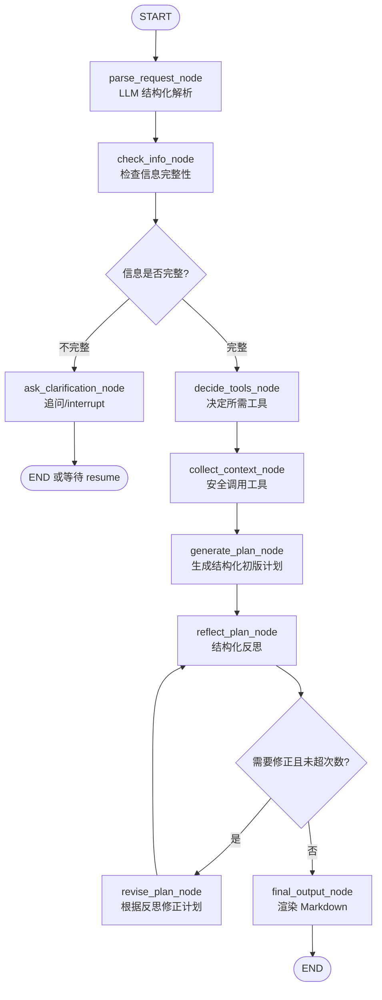

# 基于 LangChain + LangGraph 的旅行规划助手技术方案（工程闭环版）

> 项目定位：面向具备一定 Agent / Python 基础的开发者，用旅行规划场景实践 LangChain + LangGraph 的工程化 Agent 工作流。  
> 核心目标：不再从 Pure Python 教学版开始，而是直接设计一个可编码、可扩展、可测试的 **LangChain Structured Output + LangGraph 循环工作流 + Tool Adapter + Reflection 闭环** 项目。  
> 推荐实现方式：默认使用 LangChain 完成 LLM、Prompt、Tool、Structured Output；使用 LangGraph 完成 State、Node、Conditional Edge、Reflection Loop、interrupt/resume 与 checkpoint 扩展。

---

## 1. 项目目标与边界

本项目不是一个简单的“让大模型生成旅行计划”的 Demo，而是一个用于学习和展示 Agent 工程能力的完整小项目。它重点体现以下能力：

1. 使用 LangChain 封装模型调用、Prompt、Tool 和结构化输出；
2. 使用 LangGraph 编排多节点、有状态、可循环的旅行规划工作流；
3. 将用户模糊需求解析为结构化 `TravelRequest`；
4. 根据信息完整性决定是否追问用户；
5. 根据需求动态选择工具，而不是固定全量调用；
6. 通过 Tool Adapter 统一 mock 工具和真实 API 工具的输入输出；
7. 使用结构化 `TravelPlan` 表达初版计划，而不是直接生成一大段文本；
8. 使用 Reflection 节点审查计划质量，并形成真实循环：

```text
生成/修正计划 → 反思检查 → 判断是否继续修正 → 再次反思 → 最终输出
```

9. 使用 `revision_count / max_revision_count` 控制循环，防止 Agent 无限自我修正；
10. 提供端到端测试、工具失败测试、信息补全续跑测试和 Reflection 测试。

---

## 2. 为什么旅行规划适合 Workflow + Agent

旅行规划天然不是一次简单问答，而是一个多步骤、有状态、可修正的任务：

```text
用户自然语言输入
→ 结构化需求解析
→ 信息完整性检查
→ 必要时追问
→ 工具调用补充上下文
→ 生成结构化初版计划
→ Reflection 自检
→ 根据问题修正计划
→ 再次 Reflection
→ 输出 Markdown 旅行方案
```

如果只调用一次 LLM，容易出现以下问题：

- 用户信息缺失时仍然强行规划；
- 没有显式预算约束；
- 行程过满，休息时间不足；
- 景点路线不顺；
- 没有使用外部信息；
- 计划不可测试，无法定位是解析错、工具错、生成错还是反思错；
- 无法在用户补充信息后恢复流程。

因此该项目更适合采用：

```text
LangChain 负责节点内部能力
+
LangGraph 负责外层状态工作流
```

---

## 3. 技术栈与职责划分

### 3.1 LangChain 的职责

LangChain 负责“节点内部能力”。

| 能力 | 在项目中的作用 |
|---|---|
| ChatModel | 调用大模型完成解析、计划生成、反思、修正 |
| ChatPromptTemplate | 管理解析、规划、反思、修正等 Prompt |
| Structured Output | 使用 Pydantic Schema 约束模型输出 |
| Tool | 封装天气、景点、美食、预算、交通、搜索等工具 |
| Chain / Runnable | 组合 Prompt → Model → Structured Output |
| Output Parser | 将模型输出转为结构化对象或最终文本 |

核心原则：

> LangChain 不负责整个流程怎么走，它负责每个节点内部如何调用 LLM、Prompt、Tool 和结构化输出。

### 3.2 LangGraph 的职责

LangGraph 负责“外层流程编排”。

| 能力 | 在项目中的作用 |
|---|---|
| StateGraph | 构建旅行规划状态图 |
| State | 保存用户输入、结构化需求、工具上下文、计划、反思结果、错误信息 |
| Node | 将任务拆成解析、检查、工具选择、工具调用、计划生成、反思、修正、输出等步骤 |
| Edge | 定义固定执行顺序 |
| Conditional Edge | 根据信息是否完整、是否需要修正、是否超过循环次数决定下一步 |
| START / END | 定义流程入口和出口 |
| checkpoint | 保存中间状态，用于多轮和中断恢复 |
| interrupt/resume | 信息不足、人类确认或用户修改时暂停与恢复 |

核心原则：

> LangGraph 不关心你用哪个模型生成内容，它关心 State 如何流转、节点如何连接、什么时候分支、什么时候循环、什么时候结束。

---

## 4. 总体架构设计

```text
Client / CLI / FastAPI
  ↓
LangGraph Workflow
  ├── parse_request_node
  ├── check_info_node
  ├── ask_clarification_node / interrupt
  ├── decide_tools_node
  ├── collect_context_node
  ├── generate_plan_node
  ├── reflect_plan_node
  ├── revise_plan_node
  ├── final_output_node
  └── error_fallback_node（可选）
  ↓
LangChain Capability Layer
  ├── parse_chain: Prompt + Model + TravelRequest
  ├── plan_chain: Prompt + Model + TravelPlan
  ├── reflection_chain: Prompt + Model + ReflectionResult
  ├── revise_chain: Prompt + Model + TravelPlan
  └── tool wrappers
  ↓
Tool Adapter Layer
  ├── WeatherToolAdapter
  ├── AttractionToolAdapter
  ├── FoodToolAdapter
  ├── BudgetToolAdapter
  ├── TransportToolAdapter
  └── SearchToolAdapter
  ↓
Mock / Real API Providers
  ├── mock data
  ├── weather API
  ├── map API
  ├── search API
  └── local knowledge base
```

---

## 5. 工程版工作流设计

### 5.1 核心工作流



### 5.2 真实 Reflection 循环

本版本明确采用真实循环：

```text
generate_plan_node
→ reflect_plan_node
→ revise_plan_node
→ reflect_plan_node
→ ...
→ final_output_node
```

循环退出条件：

```text
1. Reflection 判断 need_revision = false
或
2. revision_count >= max_revision_count
```

推荐参数：

```python
max_revision_count = 2
```

原因：

- 允许模型至少有一次真正修正机会；
- 最多两轮修正，避免过度反思和成本失控；
- 超过次数后即使仍有问题，也进入最终输出，并在结果中说明剩余风险。

---

## 6. State 设计

### 6.1 State 分层原则

不要将所有字段平铺在最外层。推荐按职责分层：

```text
user_input：当前用户输入
request：结构化旅行需求
context：工具补充上下文
plan：当前结构化计划
reflection：最近一次反思结果
control：流程控制字段
errors：错误信息
trace：轻量执行轨迹
```

### 6.2 TravelState

```python
from typing_extensions import TypedDict
from typing import Any, Dict, List, Optional


class TravelState(TypedDict, total=False):
    # 当前用户输入
    user_input: str

    # 多轮场景下可保存原始用户输入历史
    user_inputs: List[str]

    # 结构化需求，统一保存为 Pydantic model_dump() 后的 dict
    request: Dict[str, Any]

    # 信息完整性
    missing_fields: List[str]
    clarification_questions: List[str]
    is_info_complete: bool

    # 工具选择与上下文
    required_tools: List[str]
    context: Dict[str, Any]

    # 结构化计划，统一保存为 TravelPlan.model_dump() 后的 dict
    draft_plan: Dict[str, Any]

    # 最近一次反思结果，统一保存为 ReflectionResult.model_dump() 后的 dict
    reflection: Dict[str, Any]

    # 最终 Markdown 输出
    final_plan: str

    # 流程控制
    need_revision: bool
    revision_count: int
    max_revision_count: int
    stop_reason: str

    # 错误记录
    tool_errors: List[Dict[str, Any]]
    system_errors: List[Dict[str, Any]]

    # 轻量 trace，便于 debug 和测试
    trace: List[Dict[str, Any]]
```

### 6.3 Schema 与 State 的边界

为了避免对象和 dict 混用，统一约定：

```text
Pydantic Schema：用于 LLM structured output、输入校验和单元测试。
LangGraph State：只保存 schema.model_dump() 后的 dict。
```

例如：

```python
result: TravelRequest = parse_chain.invoke({"user_input": state["user_input"]})
return {"request": result.model_dump()}
```

后续节点统一使用：

```python
state["request"]["destination"]
```

而不是：

```python
state["request"].destination
```

---

## 7. Pydantic Schema 设计

### 7.1 TravelRequest

```python
from pydantic import BaseModel, Field
from typing import List, Optional
from enum import Enum


class TravelPreference(str, Enum):
    food = "美食"
    relaxed = "轻松"
    nature = "自然风光"
    culture = "历史文化"
    shopping = "购物"
    parent_child = "亲子"
    photography = "拍照"


class TravelRequest(BaseModel):
    destination: Optional[str] = Field(default=None, description="目的地城市或地区")
    start_date: Optional[str] = Field(default=None, description="出发日期或时间范围，例如 6 月底")
    days: Optional[int] = Field(default=None, ge=1, le=30, description="旅行天数")
    budget: Optional[float] = Field(default=None, ge=0, description="总预算，单位元")
    preferences: List[str] = Field(default_factory=list, description="旅行偏好")
    companions: Optional[str] = Field(default=None, description="同行人，例如独自、情侣、朋友、亲子")
    departure_city: Optional[str] = Field(default=None, description="出发城市，可选")
    pace: Optional[str] = Field(default=None, description="旅行节奏，例如轻松、适中、紧凑")
```

### 7.2 ToolResult

所有工具统一输出结构，便于真实 API 和 mock 工具替换。

```python
class ToolResult(BaseModel):
    data: dict | list
    source: str
    updated_at: Optional[str] = None
    confidence: str = Field(description="mock/high/medium/low")
    error: Optional[str] = None
```

### 7.3 DayPlan 与 TravelPlan

```python
class Activity(BaseModel):
    time_slot: str = Field(description="morning/afternoon/evening")
    title: str
    location: Optional[str] = None
    reason: str = Field(description="为什么这样安排")
    estimated_cost: float = 0
    duration_hours: Optional[float] = None
    transport_note: Optional[str] = None
    risk_note: Optional[str] = None


class DayPlan(BaseModel):
    day: int
    theme: str
    activities: List[Activity]
    daily_estimated_cost: float
    pace_level: str = Field(description="relaxed/normal/tight")
    notes: List[str] = Field(default_factory=list)


class TravelPlan(BaseModel):
    destination: str
    total_days: int
    total_budget: float
    days: List[DayPlan]
    total_estimated_cost: float
    budget_status: str = Field(description="within_budget/slightly_over/over_budget/unknown")
    preference_match_notes: List[str] = Field(default_factory=list)
    risk_notes: List[str] = Field(default_factory=list)
    data_limitations: List[str] = Field(default_factory=list)
```

### 7.4 ReflectionResult

```python
class ReflectionResult(BaseModel):
    need_revision: bool
    score: int = Field(ge=1, le=10)
    issues: List[str] = Field(default_factory=list)
    suggestions: List[str] = Field(default_factory=list)
    blocking_issues: List[str] = Field(default_factory=list)
    accepted_as_final: bool = False
```

字段含义：

| 字段 | 说明 |
|---|---|
| `need_revision` | 是否需要继续修正 |
| `score` | 计划质量评分 |
| `issues` | 一般问题 |
| `suggestions` | 修正建议 |
| `blocking_issues` | 阻断性问题，例如预算严重超支、信息明显不足 |
| `accepted_as_final` | 是否可以直接进入最终输出 |

---

## 8. Node 设计

### 8.1 节点总览

| 节点 | 类型 | 职责 |
|---|---|---|
| `parse_request_node` | LLM + Structured Output | 将用户输入解析为 `TravelRequest` |
| `check_info_node` | 普通 Python 节点 | 检查必要字段是否完整 |
| `ask_clarification_node` | LLM/模板 + interrupt | 生成追问问题，等待用户补充 |
| `decide_tools_node` | 普通 Python / LLM Router | 根据需求决定需要调用哪些工具 |
| `collect_context_node` | Tool Node | 安全调用工具，写入 `context` |
| `generate_plan_node` | LLM + Structured Output | 生成结构化 `TravelPlan` |
| `reflect_plan_node` | LLM + Structured Output | 审查当前计划，输出 `ReflectionResult` |
| `revise_plan_node` | LLM + Structured Output | 根据反思建议修正 `TravelPlan` |
| `final_output_node` | 普通 Python / LLM | 将结构化计划渲染为 Markdown |
| `error_fallback_node` | 可选 | 异常兜底输出 |

---

## 9. 条件路由设计

### 9.1 信息完整性路由

```python
from typing import Literal


def route_after_check(state: TravelState) -> Literal["ask_clarification", "decide_tools"]:
    if state.get("is_info_complete"):
        return "decide_tools"
    return "ask_clarification"
```

### 9.2 Reflection 循环路由

```python
def route_after_reflection(state: TravelState) -> Literal["revise_plan", "final_output"]:
    reflection = state.get("reflection", {})
    need_revision = reflection.get("need_revision", False)
    accepted_as_final = reflection.get("accepted_as_final", False)

    revision_count = state.get("revision_count", 0)
    max_revision_count = state.get("max_revision_count", 2)

    if accepted_as_final:
        return "final_output"

    if need_revision and revision_count < max_revision_count:
        return "revise_plan"

    return "final_output"
```

### 9.3 循环退出原因

`final_output_node` 应根据状态写出退出原因：

```text
accepted_by_reflection：Reflection 通过
max_revision_reached：达到最大修正次数
no_revision_needed：无需修正
fallback：异常兜底
```

---

## 10. Tool Adapter 设计

### 10.1 为什么需要 Adapter

旅行规划的工具来源会不断变化：

```text
Mock 数据
→ 搜索 API
→ 天气 API
→ 地图 API
→ 酒店/门票平台 API
```

如果工作流直接依赖某个具体 API，后续替换成本会很高。因此建议在工具层设计统一 Adapter。

核心原则：

```text
工具名稳定
输入 schema 稳定
输出 ToolResult 稳定
内部 provider 可替换
```

### 10.2 工具清单

| 工具名 | 输入 | 输出 | 说明 |
|---|---|---|---|
| `get_weather` | city, date_range | ToolResult | 查询天气与风险 |
| `search_attractions` | city, preferences | ToolResult | 查询景点 |
| `search_foods` | city, preferences | ToolResult | 查询美食 |
| `estimate_budget` | city, days, budget | ToolResult | 预算估算 |
| `search_transport` | city, start_date | ToolResult | 市内交通建议 |
| `web_search` | query | ToolResult | 获取最新营业时间、票价、临时通知 |

### 10.3 工具输出规范

```python
{
    "data": ...,                    # 核心数据
    "source": "mock_weather",      # 数据来源
    "updated_at": "2026-05-27",    # 更新时间
    "confidence": "mock",          # mock/high/medium/low
    "error": None                   # 错误信息
}
```

### 10.4 安全工具调用

每个工具单独调用，避免一个工具失败导致后续工具全部跳过。

```python
from datetime import date
from typing import Any


def fallback_tool_result(source: str, error: str) -> dict:
    return {
        "data": {},
        "source": source,
        "updated_at": str(date.today()),
        "confidence": "low",
        "error": error,
    }


def safe_tool_call(tool, args: dict, fallback_source: str) -> tuple[dict, dict | None]:
    try:
        result = tool.invoke(args)
        return result, None
    except Exception as e:
        error = {
            "tool": getattr(tool, "name", str(tool)),
            "args": args,
            "error": str(e),
        }
        return fallback_tool_result(fallback_source, str(e)), error
```

### 10.5 collect_context_node

```python
def collect_context_node(state: TravelState) -> dict:
    request = state["request"]
    city = request["destination"]
    days = request["days"]
    budget = request["budget"]
    preferences = request.get("preferences", [])
    date_range = request.get("start_date")
    required_tools = state.get("required_tools", [])

    context = {}
    errors = list(state.get("tool_errors", []))

    if "weather" in required_tools:
        result, err = safe_tool_call(
            get_weather,
            {"city": city, "date_range": date_range},
            "fallback_weather",
        )
        context["weather"] = result
        if err:
            errors.append(err)

    if "attractions" in required_tools:
        result, err = safe_tool_call(
            search_attractions,
            {"city": city, "preferences": preferences},
            "fallback_attractions",
        )
        context["attractions"] = result
        if err:
            errors.append(err)

    if "foods" in required_tools:
        result, err = safe_tool_call(
            search_foods,
            {"city": city, "preferences": preferences},
            "fallback_foods",
        )
        context["foods"] = result
        if err:
            errors.append(err)

    if "budget" in required_tools:
        result, err = safe_tool_call(
            estimate_budget,
            {"city": city, "days": days, "budget": budget},
            "fallback_budget",
        )
        context["budget_estimate"] = result
        if err:
            errors.append(err)

    if "transport" in required_tools:
        result, err = safe_tool_call(
            search_transport,
            {"city": city, "start_date": date_range},
            "fallback_transport",
        )
        context["transport"] = result
        if err:
            errors.append(err)

    return {
        "context": context,
        "tool_errors": errors,
    }
```

---

## 11. 动态工具选择策略

### 11.1 规则版工具选择

```python
def decide_tools_node(state: TravelState) -> dict:
    request = state["request"]
    preferences = request.get("preferences", [])

    required_tools = ["weather", "attractions", "budget", "transport"]

    if "美食" in preferences:
        required_tools.append("foods")

    if request.get("start_date"):
        required_tools.append("web_search")

    return {"required_tools": list(dict.fromkeys(required_tools))}
```

### 11.2 LLM Router 版本

后续可以将 `decide_tools_node` 升级为 LLM Router，让模型输出：

```python
class ToolDecision(BaseModel):
    required_tools: List[str]
    reasons: List[str]
```

适合场景：

- 用户偏好多样；
- 工具数量变多；
- 需要根据任务复杂度动态决定是否搜索最新信息。

---

## 12. LangChain Chain 设计

### 12.1 初始化模型

```python
from langchain.chat_models import init_chat_model

model = init_chat_model("openai:gpt-4o-mini", temperature=0)
```

如果你使用国内模型，可以通过兼容 OpenAI API 的方式接入，例如 Qwen、DeepSeek、Moonshot 等，具体取决于你本地环境和 API 兼容层。

### 12.2 parse_chain

```python
from langchain_core.prompts import ChatPromptTemplate

parse_prompt = ChatPromptTemplate.from_messages([
    ("system", """
你是一个旅行需求解析器。请从用户输入中抽取结构化旅行需求。
如果某个字段没有明确出现，请返回 null 或空列表，不要编造。
"""),
    ("human", "用户输入：{user_input}")
])

parse_chain = parse_prompt | model.with_structured_output(TravelRequest)
```

### 12.3 plan_chain

```python
plan_prompt = ChatPromptTemplate.from_messages([
    ("system", """
你是一个专业旅行规划师。请根据用户结构化需求和工具上下文生成结构化旅行计划。
要求：
1. 严格围绕用户预算、天数、偏好；
2. 每天安排 morning/afternoon/evening；
3. 给出每个活动的理由、预计花费和风险提醒；
4. 不要编造工具上下文中没有的强事实；
5. 对 mock 或低置信度信息要在 data_limitations 中说明。
"""),
    ("human", """
用户需求：
{request}

工具上下文：
{context}
""")
])

plan_chain = plan_prompt | model.with_structured_output(TravelPlan)
```

### 12.4 reflection_chain

```python
reflection_prompt = ChatPromptTemplate.from_messages([
    ("system", """
你是一个旅行计划审查员。请审查计划是否合理。
重点检查：
1. 是否超预算；
2. 是否行程过满；
3. 是否符合用户偏好；
4. 是否存在天气、交通、数据置信度风险；
5. 是否存在明显信息缺失；
6. 是否需要继续修正。

请输出结构化 ReflectionResult。
"""),
    ("human", """
用户需求：
{request}

工具上下文：
{context}

当前计划：
{draft_plan}

当前修正次数：{revision_count}
最大修正次数：{max_revision_count}
""")
])

reflection_chain = reflection_prompt | model.with_structured_output(ReflectionResult)
```

### 12.5 revise_chain

```python
revise_prompt = ChatPromptTemplate.from_messages([
    ("system", """
你是一个旅行计划修正器。请根据 Reflection 的 issues 和 suggestions 修正当前计划。
要求：
1. 保持 TravelPlan 结构；
2. 优先解决 blocking_issues；
3. 不要改变用户核心需求；
4. 若预算超支，应降低成本或明确说明不可避免原因；
5. 若行程过紧，应减少活动或增加休息时间。
"""),
    ("human", """
用户需求：
{request}

工具上下文：
{context}

当前计划：
{draft_plan}

反思结果：
{reflection}
""")
])

revise_chain = revise_prompt | model.with_structured_output(TravelPlan)
```

---

## 13. Node 关键代码骨架

### 13.1 parse_request_node

```python
def parse_request_node(state: TravelState) -> dict:
    user_input = state["user_input"]
    user_inputs = state.get("user_inputs", []) + [user_input]

    result: TravelRequest = parse_chain.invoke({"user_input": user_input})

    prev_request = state.get("request", {})
    new_request = result.model_dump()

    # 多轮补充时，保留旧字段，用新输入覆盖非空字段
    merged_request = {**prev_request}
    for key, value in new_request.items():
        if value not in [None, "", []]:
            merged_request[key] = value

    return {
        "user_inputs": user_inputs,
        "request": merged_request,
        "revision_count": state.get("revision_count", 0),
        "max_revision_count": state.get("max_revision_count", 2),
        "tool_errors": state.get("tool_errors", []),
        "system_errors": state.get("system_errors", []),
        "trace": state.get("trace", []) + [{"node": "parse_request", "status": "ok"}],
    }
```

### 13.2 check_info_node

```python
def check_info_node(state: TravelState) -> dict:
    request = state.get("request", {})
    missing = []

    required_fields = ["destination", "days", "budget", "preferences"]

    for field in required_fields:
        value = request.get(field)
        if value in [None, "", []]:
            missing.append(field)

    return {
        "missing_fields": missing,
        "is_info_complete": len(missing) == 0,
        "trace": state.get("trace", []) + [{"node": "check_info", "missing": missing}],
    }
```

### 13.3 ask_clarification_node

工程版建议支持两种模式：

```text
CLI/简单版：返回 clarification_questions，然后 END。
服务化版：使用 interrupt 暂停，等待用户补充后 resume。
```

简单版：

```python
def ask_clarification_node(state: TravelState) -> dict:
    field_to_question = {
        "destination": "你想去哪个城市或地区旅行？",
        "days": "你计划玩几天？",
        "budget": "你的总预算大概是多少？",
        "preferences": "你更偏好美食、自然风光、历史文化、购物，还是轻松休闲路线？",
    }

    questions = [
        field_to_question[field]
        for field in state.get("missing_fields", [])
        if field in field_to_question
    ]

    return {
        "clarification_questions": questions,
        "stop_reason": "need_user_clarification",
        "final_plan": "为了更准确地规划行程，请先补充：\n" + "\n".join(f"- {q}" for q in questions),
    }
```

进阶版可在该节点中使用 `interrupt()`，并配合 checkpointer 保存图状态。

### 13.4 generate_plan_node

```python
def generate_plan_node(state: TravelState) -> dict:
    result: TravelPlan = plan_chain.invoke({
        "request": state["request"],
        "context": state.get("context", {}),
    })

    return {
        "draft_plan": result.model_dump(),
        "trace": state.get("trace", []) + [{"node": "generate_plan", "status": "ok"}],
    }
```

### 13.5 reflect_plan_node

```python
def reflect_plan_node(state: TravelState) -> dict:
    result: ReflectionResult = reflection_chain.invoke({
        "request": state["request"],
        "context": state.get("context", {}),
        "draft_plan": state["draft_plan"],
        "revision_count": state.get("revision_count", 0),
        "max_revision_count": state.get("max_revision_count", 2),
    })

    stop_reason = "reflection_need_revision" if result.need_revision else "accepted_by_reflection"

    return {
        "reflection": result.model_dump(),
        "need_revision": result.need_revision,
        "stop_reason": stop_reason,
        "trace": state.get("trace", []) + [{
            "node": "reflect_plan",
            "need_revision": result.need_revision,
            "score": result.score,
        }],
    }
```

### 13.6 revise_plan_node

```python
def revise_plan_node(state: TravelState) -> dict:
    result: TravelPlan = revise_chain.invoke({
        "request": state["request"],
        "context": state.get("context", {}),
        "draft_plan": state["draft_plan"],
        "reflection": state["reflection"],
    })

    revision_count = state.get("revision_count", 0) + 1

    return {
        "draft_plan": result.model_dump(),
        "revision_count": revision_count,
        "need_revision": False,
        "trace": state.get("trace", []) + [{
            "node": "revise_plan",
            "revision_count": revision_count,
        }],
    }
```

### 13.7 final_output_node

```python
def final_output_node(state: TravelState) -> dict:
    plan = state["draft_plan"]
    reflection = state.get("reflection", {})
    tool_errors = state.get("tool_errors", [])
    revision_count = state.get("revision_count", 0)
    max_revision_count = state.get("max_revision_count", 2)

    lines = []
    lines.append(f"# {plan['destination']}{plan['total_days']}日旅行方案")
    lines.append("")
    lines.append("## 一、行程概览")
    lines.append(f"- 总预算：{plan['total_budget']} 元")
    lines.append(f"- 预计花费：{plan['total_estimated_cost']} 元")
    lines.append(f"- 预算状态：{plan.get('budget_status', 'unknown')}")
    lines.append(f"- 已完成修正轮次：{revision_count}/{max_revision_count}")
    lines.append("")

    for day in plan["days"]:
        lines.append(f"## Day {day['day']}：{day['theme']}")
        lines.append(f"- 节奏：{day.get('pace_level', 'normal')}")
        lines.append(f"- 预计花费：{day['daily_estimated_cost']} 元")

        for activity in day["activities"]:
            lines.append(f"- {activity['time_slot']}：{activity['title']}")
            if activity.get("location"):
                lines.append(f"  - 地点：{activity['location']}")
            lines.append(f"  - 安排理由：{activity['reason']}")
            if activity.get("transport_note"):
                lines.append(f"  - 交通提示：{activity['transport_note']}")
            if activity.get("risk_note"):
                lines.append(f"  - 风险提示：{activity['risk_note']}")
        lines.append("")

    if plan.get("preference_match_notes"):
        lines.append("## 二、偏好匹配说明")
        for note in plan["preference_match_notes"]:
            lines.append(f"- {note}")
        lines.append("")

    if plan.get("risk_notes"):
        lines.append("## 三、出行风险与提醒")
        for note in plan["risk_notes"]:
            lines.append(f"- {note}")
        lines.append("")

    if reflection:
        lines.append("## 四、方案自检结果")
        lines.append(f"- 质量评分：{reflection.get('score', 'unknown')}/10")
        if reflection.get("issues"):
            lines.append("- 已识别问题：")
            for issue in reflection["issues"]:
                lines.append(f"  - {issue}")
        if state.get("revision_count", 0) >= state.get("max_revision_count", 2) and reflection.get("need_revision"):
            lines.append("- 说明：已达到最大修正次数，仍建议出行前人工确认关键细节。")
        lines.append("")

    if plan.get("data_limitations") or tool_errors:
        lines.append("## 五、数据限制说明")
        for item in plan.get("data_limitations", []):
            lines.append(f"- {item}")
        if tool_errors:
            lines.append("- 部分工具调用失败或返回低置信度数据，建议出行前再次确认天气、景点开放时间、门票和交通情况。")

    return {
        "final_plan": "\n".join(lines),
        "stop_reason": state.get("stop_reason", "final_output"),
    }
```

---

## 14. Workflow 代码骨架

```python
from langgraph.graph import StateGraph, START, END


def build_graph(checkpointer=None):
    builder = StateGraph(TravelState)

    builder.add_node("parse_request", parse_request_node)
    builder.add_node("check_info", check_info_node)
    builder.add_node("ask_clarification", ask_clarification_node)
    builder.add_node("decide_tools", decide_tools_node)
    builder.add_node("collect_context", collect_context_node)
    builder.add_node("generate_plan", generate_plan_node)
    builder.add_node("reflect_plan", reflect_plan_node)
    builder.add_node("revise_plan", revise_plan_node)
    builder.add_node("final_output", final_output_node)

    builder.add_edge(START, "parse_request")
    builder.add_edge("parse_request", "check_info")

    builder.add_conditional_edges(
        "check_info",
        route_after_check,
        {
            "ask_clarification": "ask_clarification",
            "decide_tools": "decide_tools",
        },
    )

    builder.add_edge("ask_clarification", END)

    builder.add_edge("decide_tools", "collect_context")
    builder.add_edge("collect_context", "generate_plan")
    builder.add_edge("generate_plan", "reflect_plan")

    builder.add_conditional_edges(
        "reflect_plan",
        route_after_reflection,
        {
            "revise_plan": "revise_plan",
            "final_output": "final_output",
        },
    )

    # 真实循环：修正后重新反思
    builder.add_edge("revise_plan", "reflect_plan")

    builder.add_edge("final_output", END)

    return builder.compile(checkpointer=checkpointer)
```

---

## 15. 信息不足时的继续机制

### 15.1 简单服务版：重新 invoke 并合并 State

如果暂时不使用 interrupt/resume，可以在用户补充信息后清理旧字段并重新执行。

```python
def prepare_followup_state(prev_state: dict, new_user_input: str) -> dict:
    state = prev_state.copy()
    state["user_input"] = new_user_input

    # 清理上一轮追问和输出字段，避免残留污染后续流程
    for key in [
        "clarification_questions",
        "final_plan",
        "missing_fields",
        "is_info_complete",
        "required_tools",
        "context",
        "draft_plan",
        "reflection",
        "need_revision",
        "stop_reason",
    ]:
        state.pop(key, None)

    return state
```

### 15.2 interrupt/resume 版本

服务化后建议使用：

```text
ask_clarification_node 中 interrupt
→ 前端展示问题
→ 用户补充
→ resume
→ 从暂停点继续执行
```

要求：

1. graph compile 时配置 checkpointer；
2. 每个会话传入 thread_id；
3. interrupt 的返回值要能被节点读取并合并进 request。

---

## 16. 项目目录结构

直接采用工程化目录，不再使用教学版 V0 结构。

```text
travel-planning-agent/
  README.md
  pyproject.toml
  .env.example

  app/
    __init__.py
    main.py

    graph/
      __init__.py
      state.py
      workflow.py
      nodes.py
      routers.py

    chains/
      __init__.py
      parse_chain.py
      plan_chain.py
      reflection_chain.py
      revise_chain.py

    prompts/
      __init__.py
      parse_prompt.py
      plan_prompt.py
      reflection_prompt.py
      revise_prompt.py

    tools/
      __init__.py
      base.py
      weather_tool.py
      attraction_tool.py
      food_tool.py
      budget_tool.py
      transport_tool.py
      search_tool.py

    schemas/
      __init__.py
      travel_request.py
      travel_plan.py
      reflection.py
      tool_result.py

    config/
      __init__.py
      settings.py

    services/
      __init__.py
      session_service.py
      planner_service.py

  tests/
    test_parse.py
    test_tools.py
    test_reflection.py
    test_workflow.py
    test_followup.py
    test_tool_failure.py

  docs/
    architecture.md
    workflow.md
    prompt_design.md
    eval_plan.md
```

---

## 17. 开发步骤

### Step 1：初始化工程

```bash
mkdir travel-planning-agent
cd travel-planning-agent
python -m venv .venv
source .venv/bin/activate  # Windows: .venv\Scripts\activate
pip install langchain langgraph langchain-openai pydantic python-dotenv pytest
```

建议在 `pyproject.toml` 或 `requirements.txt` 中固定版本，避免 LangChain / LangGraph API 变化导致导入路径不一致。

### Step 2：定义 Schema

先完成：

```text
TravelRequest
ToolResult
Activity
DayPlan
TravelPlan
ReflectionResult
```

### Step 3：定义 State

按照分层结构定义 `TravelState`。

### Step 4：实现 Tool Adapter

先实现 mock provider，但保持真实 API 可替换：

```text
get_weather
search_attractions
search_foods
estimate_budget
search_transport
web_search
```

### Step 5：实现 LangChain Chains

完成：

```text
parse_chain
plan_chain
reflection_chain
revise_chain
```

### Step 6：实现 Nodes

按顺序实现：

```text
parse_request_node
check_info_node
ask_clarification_node
decide_tools_node
collect_context_node
generate_plan_node
reflect_plan_node
revise_plan_node
final_output_node
```

### Step 7：实现 Routers

完成：

```text
route_after_check
route_after_reflection
```

### Step 8：组装 Workflow

核心是：

```text
generate_plan → reflect_plan → revise_plan → reflect_plan
```

### Step 9：测试闭环

至少覆盖：

```text
完整输入端到端
信息缺失追问
用户补充后继续
工具失败不中断
Reflection 触发修正
Reflection 达到最大修正次数后退出
```

### Step 10：服务化

封装：

```text
PlannerService.plan(user_input, session_id=None)
PlannerService.continue_plan(session_id, user_input)
```

后续接 FastAPI。

---

## 18. 测试设计

### 18.1 端到端成功测试

```python
def test_workflow_success():
    graph = build_graph()

    result = graph.invoke({
        "user_input": "我想 6 月底去成都玩 3 天，预算 3000 元，喜欢美食和轻松路线",
        "max_revision_count": 2,
    })

    assert "final_plan" in result
    assert "成都" in result["final_plan"]
    assert result["revision_count"] <= 2
```

### 18.2 信息缺失追问测试

```python
def test_missing_info_clarification():
    graph = build_graph()

    result = graph.invoke({"user_input": "我想出去玩"})

    assert result["stop_reason"] == "need_user_clarification"
    assert len(result["clarification_questions"]) > 0
```

### 18.3 用户补充后继续测试

```python
def test_followup_after_clarification():
    graph = build_graph()

    result1 = graph.invoke({"user_input": "我想出去玩"})
    state2 = prepare_followup_state(
        result1,
        "去成都，3天，预算3000，喜欢美食和轻松路线",
    )

    result2 = graph.invoke(state2)

    assert "final_plan" in result2
    assert "成都" in result2["final_plan"]
```

### 18.4 工具失败不中断测试

```python
def test_tool_failure_does_not_break_workflow(monkeypatch):
    def broken_weather(*args, **kwargs):
        raise RuntimeError("weather api failed")

    monkeypatch.setattr("app.tools.weather_tool.get_weather.invoke", broken_weather)

    graph = build_graph()
    result = graph.invoke({
        "user_input": "我想 6 月底去成都玩 3 天，预算 3000 元，喜欢美食",
        "max_revision_count": 2,
    })

    assert "final_plan" in result
    assert len(result.get("tool_errors", [])) > 0
```

### 18.5 Reflection 循环测试

```python
def test_reflection_loop_max_revision():
    graph = build_graph()

    result = graph.invoke({
        "user_input": "我想去成都玩3天，预算500元，想吃美食还要轻松",
        "max_revision_count": 2,
    })

    assert result["revision_count"] <= 2
    assert "final_plan" in result
```

---

## 19. 评估指标设计

| 评估层级 | 指标 | 说明 |
|---|---|---|
| 需求解析 | Slot Accuracy | 目的地、天数、预算、偏好是否抽对 |
| 信息检查 | Missing Field Recall | 缺失字段是否识别完整 |
| 工具调用 | Tool Success Rate | 工具是否成功返回统一结构 |
| 工具选择 | Tool Selection Accuracy | 是否调用了必要工具，是否避免无关工具 |
| 计划生成 | Plan Validity | 是否天数正确、预算合理、结构完整 |
| Reflection | Issue Detection Rate | 是否发现明显问题 |
| 修正 | Revision Effectiveness | 修正后评分是否提升 |
| 端到端 | Task Success Rate | 是否生成可用最终方案 |
| 系统 | Latency / Cost | 耗时和模型调用成本 |

建议构造 30—50 条小型评估集：

```json
{
  "case_id": "travel_001",
  "user_input": "我想6月底去成都玩3天，预算3000，喜欢美食和轻松路线",
  "expected_slots": {
    "destination": "成都",
    "days": 3,
    "budget": 3000,
    "preferences": ["美食", "轻松"]
  },
  "expected_tools": ["weather", "attractions", "foods", "budget", "transport"],
  "must_have_in_plan": ["成都", "美食", "预算", "Day 1"]
}
```

---

## 20. FastAPI 服务化设计

### 20.1 API 设计

```text
POST /travel-plan
POST /travel-plan/{session_id}/continue
GET /travel-plan/{session_id}
```

### 20.2 请求示例

```json
{
  "user_input": "我想 6 月底去成都玩 3 天，预算 3000 元，喜欢美食和轻松路线",
  "max_revision_count": 2
}
```

### 20.3 响应示例

```json
{
  "status": "completed",
  "final_plan": "# 成都3日旅行方案...",
  "need_user_input": false,
  "clarification_questions": [],
  "trace_id": "travel_xxx"
}
```

信息不足时：

```json
{
  "status": "need_user_clarification",
  "need_user_input": true,
  "clarification_questions": [
    "你想去哪个城市或地区旅行？",
    "你的总预算大概是多少？"
  ],
  "session_id": "session_xxx"
}
```

---

## 21. 版本与依赖建议

LangChain 和 LangGraph API 迭代较快，建议固定依赖版本，并在 README 中写清楚：

```text
python >= 3.11
langchain >= 1.1
langgraph >= 1.0
langchain-openai >= 1.0
pydantic >= 2.0
pytest >= 8.0
```

实际版本以本地安装和官方文档为准。如果遇到导入路径变化，应优先查阅官方文档。

---

## 22. 最终能力闭环

完成该项目后，你应该掌握：

1. 如何用 LangChain Structured Output 约束模型输出；
2. 如何用 LangGraph 构建有状态、多分支、可循环的 Agent Workflow；
3. 如何设计清晰的 State，避免字段混乱；
4. 如何实现真实 Reflection Loop；
5. 如何用 max revision 控制循环边界；
6. 如何设计 Tool Adapter，支持 mock 与真实 API 替换；
7. 如何处理工具失败而不让整个图崩溃；
8. 如何支持信息不足时追问和用户补充续跑；
9. 如何构建测试集验证 Agent 的各个环节；
10. 如何将一个小型 Agent 项目包装成可展示的工程作品。

---

## 23. 参考资料

- LangChain Overview: https://docs.langchain.com/oss/python/langchain/overview
- LangChain Structured Output: https://docs.langchain.com/oss/python/langchain/structured-output
- LangChain Tools: https://docs.langchain.com/oss/python/langchain/tools
- LangGraph Overview: https://docs.langchain.com/oss/python/langgraph/overview
- LangGraph Interrupts: https://docs.langchain.com/oss/python/langgraph/interrupts
- LangGraph GitHub: https://github.com/langchain-ai/langgraph

